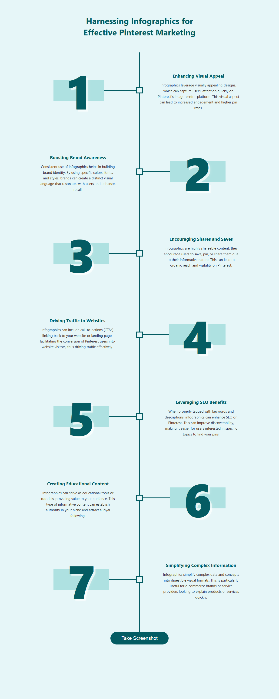

# 📸 Screenshot Taker

A web application built with Node.js, Express, HTML, CSS, and Puppeteer that allows users to take screenshots of the web pages. The application captures the screenshot and provides it for download.



## 🚀 Features

- Utilizes Puppeteer for headless browser automation
- Simple and intuitive user interface
- Download the captured screenshot directly

## 🛠 Installation & Start

```bash
# Clone the repository
git clone https://github.com/sksumit141/Screenshot-Taker.git
cd Screenshot-Taker

# Install dependencies and start the server
npm install && node backend/app.js
